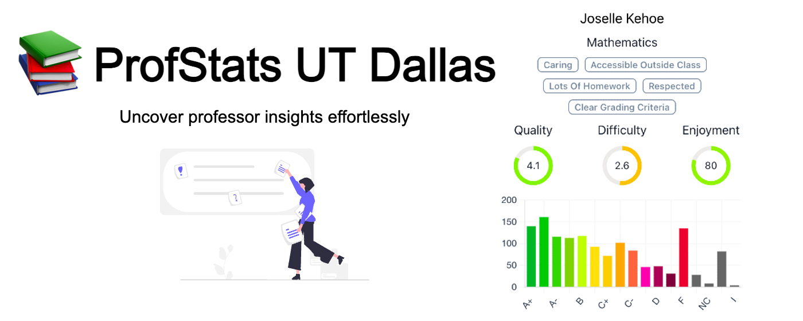

<h1 align="center">ProfStatsUTD</h1>

<p align="center">
  
</p>

[](https://chromewebstore.google.com/detail/profstats-ut-dallas/doilmgfedjlpepeaolcfpdmkehecdaff)

ProfStats is a handy Chrome extension with 100+ users, merging professor ratings and grade distributions at the University of Texas at Dallas for simplified access to course information for students.

## Frontend Overview

[](https://vitejs.dev/)
[](https://reactjs.org/)
[](https://chakra-ui.com/)
[](https://www.npmjs.com/package/axios/)

The front end ensures a streamlined interface with features like backend performance optimization, client-side validation for data accuracy, and [CRXJS](https://crxjs.dev/vite-plugin/) for Chrome extension hot module reloading during development.

### Deployment

GitHub Actions automates staging on the Chrome Web Store upon new Github version releases, utilizing the [Chrome-Webstore-Upload-Action](https://github.com/fregante/chrome-webstore-upload). While manual review submission is required, the uploading process is fully automated.

## Backend Overview

[](https://golang.org/)
[](https://www.python.org/)
[](https://www.sqlite.org/index.html)
[](https://www.docker.com/)
[](https://azure.microsoft.com/en-us/)

Utilizing the Golang Gin framework, the backend fetches ratings from the Rate My Professor GraphQL API and queries aggregated grade distribution from an SQLite database.

### Database

The database is dynamically generated by a Python script in `db_setup` before the backend server is started, using only Python's standard library and the grade distributions in `raw_data`.

> [!NOTE]  
> The grade distributions in `raw_data` are from the [UTD Grades](https://github.com/acmutd/utd-grades/tree/master/raw_data) repository

### CORS Configuration

The API allows requests only from the following origin:

-   `chrome-extension://doilmgfedjlpepeaolcfpdmkehecdaff`

### Deployment

Dockerized and deployed on the Azure Web App Service after running the Python scripts that generate and test the SQLite database, using GitHub Actions for CI/CD.

## Local Development

> [!NOTE]  
> This project uses the `concurrently` package to run the server and extension concurrently. Check out the `package.json` file for more details.

Make sure you have the following software installed on your machine:

-   Node.js
-   Golang
-   Python

### Steps:

1. **Clone the repository:**

    ```bash
    git clone https://github.com/GiridharRNair/ProfStatsUTD
    ```

2. **Navigate to the project directory:**

    ```bash
    cd ProfStatsUTD
    ```

3. **Install dependencies:**

    ```bash
    npm run install-packages
    ```

4. **Start the server and extension concurrently:**

    ```bash
    npm run dev
    ```

5. **Enable Developer Mode in Chrome:**

    - Navigate to `chrome://extensions/`.
    - Enable Developer Mode.

6. **Load the extension:**

    - Unpack the `dist` folder.
    - Start using the extension for seamless testing and development.

Please feel free to open an issue or submit a pull request if you have any suggestions or feedback.
