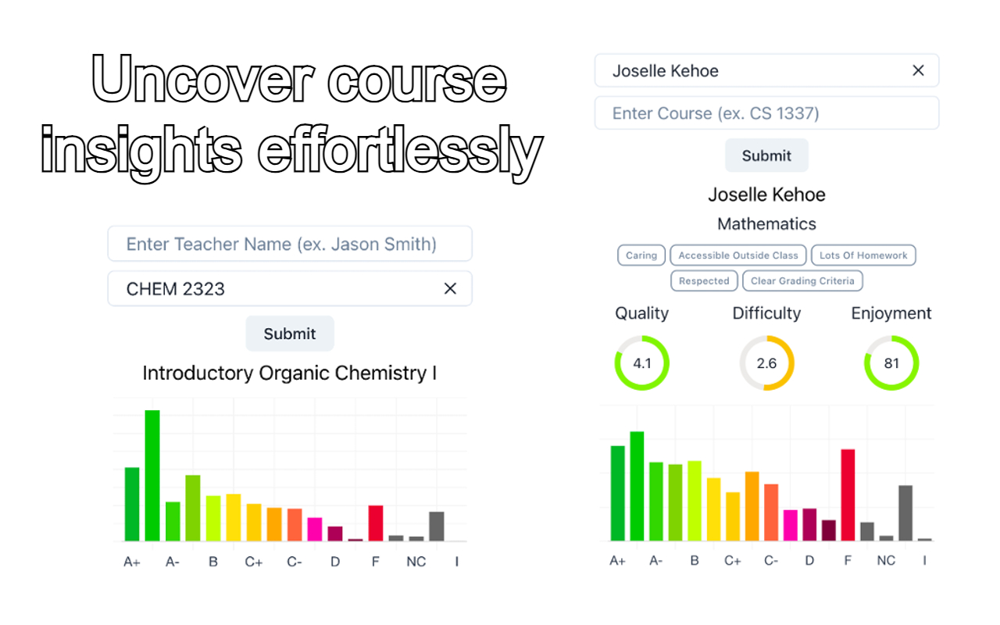

<h1 align="center">ProfStatsUTD</h1>

This extension offers a user-friendly interface for accessing aggregated grades and professor ratings effortlessly.

ProfStats is an extension that combines professor ratings from RateMyProfessor.com and grade distributions from UTDgrades.com into a single, convenient location. This allows students to easily and quickly access important information about their professors during the course registration season.

  

## Installation and Development

### Setting up ProfStatsUTD in your Browser

0. Ensure you have a virtual enviroment set up with Python 3.8+.
1. Clone the repository: `git clone https://github.com/GiridharRNair/ProfStatsUTD`
2. Install the required dependencies using `npm run install-packages`.
3. Start the development server with `npm run start`.
4. Access the app in your browser at `http://localhost:5173/`.

### Testing the ProfStatsUTD Chrome Extension

Before testing the ProfStatsUTD Chrome extension in your Chrome browser, ensure that you have the necessary packages installed:

1. Build the app with `npm run build` to generate the `dist` folder.
2. Open your Chrome browser.
3. Navigate to `chrome://extensions/`.
4. Enable "Developer mode" using the toggle switch.
5. Click on "Load unpacked" and select the `dist` folder within the `extension` directory in your cloned repository.
6. The ProfStatsUTD Chrome extension will be loaded and ready for use.

## [Backend Overview](/server/README.md)

The ProfStatsUTD Backend, powered by FastAPI, drives the Chrome extension, offering consolidated UTD course grades and professor ratings. Utilizing an SQLite database from [utd-grades](https://github.com/acmutd/utd-grades), it exposes key endpoints (`/grades` and `/ratings`) for data retrieval, requiring teacher names and optional course details.

Backend deployment is automated through a CI/CD pipeline ([main_profstatsutd.yml](/.github/workflows/main_profstatsutd.yml)), streamlining Docker image creation, Azure Container Registry upload, and Azure Web App deployment. This ensures a smooth development-to-production workflow.

## [Frontend Overview](/extension/README.md)

The ProfStatsUTD Frontend powers the Chrome extension, offering an intuitive interface for accessing aggregated grades and professor ratings seamlessly. Developed using Chakra UI and Vite, this frontend ensures a visually appealing and user-friendly experience.`

  

## Acknowledgments

- [UTD Grades](https://utdgrades.com/)
- [The Rate My Professor Python Package](https://github.com/Nobelz/RateMyProfessorAPI)

## License

This project is licensed under the [MIT](LICENSE) License.
