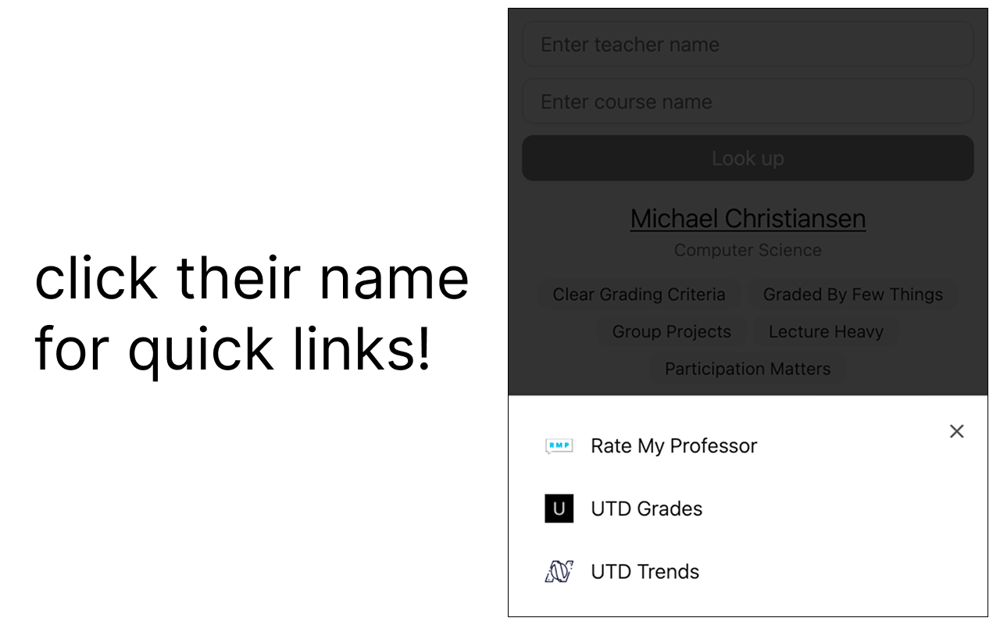

<p align="center">
  
  
</p>

[](https://chromewebstore.google.com/detail/profstats-ut-dallas/doilmgfedjlpepeaolcfpdmkehecdaff)

ProfStats is a handy Chrome extension with 150+ users, merging professor ratings and grade distributions at the University of Texas at Dallas for simplified access to course information for students.

Enter a professor and a course, and the popup shows their RateMyProfessors rating, difficulty, tags, and the grade distribution for that specific course. Clicking the professor's name opens links to RateMyProfessors, UTD Grades, and UTD Trends.

## Layout

```text
extension/    Plasmo + React + TypeScript Chrome extension
api/          FastAPI app deployed as Vercel Python serverless functions
scripts/      Python data import and maintenance scripts
supabase/     SQL schema files and indexes
raw_data/     Source grade distribution files
docs/         Screenshots used in this README
```

Grade data comes from CSV files in `raw_data`, sourced from [UTD Grades](https://github.com/acmutd/utd-grades), imported into Supabase. RateMyProfessors ratings are fetched live on each lookup, so they are never stored.

## Local Development

You will need **Node.js 20.19+** and **Python 3.12+**.

```bash
git clone https://github.com/GiridharRNair/ProfStatsUTD
cd ProfStatsUTD
```

### API

1. **Install the Python dependencies.**

    ```bash
    python3 -m pip install -r requirements.txt
    ```

    This is the development set: the runtime packages plus `ruff`, `mypy`, and `openpyxl` for the importer. What actually ships to Vercel is declared separately in `api/pyproject.toml`, which is why that file is the one to edit when adding a runtime dependency.

2. **Provide Supabase credentials.**

    ```bash
    cp .env.example .env
    ```

    Fill in `SUPABASE_URL` and `SUPABASE_SECRET_KEY` from your Supabase project. The secret key is used only by trusted server and importer environments, never by the extension. Without these, `/health` still works but `/suggestions` and `/professor_info` return `500`.

3. **Run the server.**

    ```bash
    fastapi dev api/index.py
    ```

    This serves on `http://localhost:8000` with auto-reload, which is the address the extension falls back to when no API URL is configured. `api/index.py` is also the entry point Vercel uses, so you are running the same app locally that gets deployed.

4. **Check it responds.**

    ```bash
    curl http://localhost:8000/health
    ```

Interactive API docs are at `http://localhost:8000/docs`.

#### API checks

Run these from `api/`. Both read their configuration from `api/pyproject.toml`, whose paths are relative to that directory, so they will not work from the repo root.

```bash
cd api
```

| Command          | What it does                                                                 |
| ---------------- | ---------------------------------------------------------------------------- |
| `ruff check .`   | Lints for errors, unused imports, and import ordering.                       |
| `ruff format .`  | Formats the Python sources.                                                  |
| `mypy`           | Type checks `app/` and `index.py` in strict mode.                            |

### Extension

1. **Install the dependencies.**

    ```bash
    cd extension
    npm install
    ```

2. **Point it at an API.**

    The extension reads `PLASMO_PUBLIC_API_URL` from the repo-root `.env`, which Plasmo inlines at build time. Leave it unset to use `http://localhost:8000`, or set it to a deployed URL to develop the popup against production data.

3. **Start the dev build.**

    ```bash
    npm run dev
    ```

    Plasmo watches the sources and rebuilds into `extension/build/chrome-mv3-dev`.

4. **Load it into Chrome.**

    - Go to `chrome://extensions/`.
    - Turn on Developer Mode.
    - Choose "Load unpacked" and select `extension/build/chrome-mv3-dev`.

    The extension keeps a fixed ID across reloads and releases because `package.json` carries the signing key under `manifest.key`. Reload from the extensions page to pick up a rebuild.

5. **Build for release.**

    ```bash
    npm run build
    npm run package
    ```

    `build` writes `extension/build/chrome-mv3-prod`; `package` zips it for the Chrome Web Store.

#### Extension checks

Run these from `extension/`.

| Command                | What it does                                                                    |
| ---------------------- | ------------------------------------------------------------------------------- |
| `npm run typecheck`    | `tsc --noEmit` over the sources.                                                |
| `npm run lint`         | ESLint with type-aware TypeScript, React, and React Hooks rules.                |
| `npm run lint:fix`     | The same, applying fixes.                                                       |
| `npm run format`       | Prettier, four-space indent.                                                    |
| `npm run format:check` | Prettier in check mode, for CI.                                                 |
| `npm run build`        | Production build; also the fastest way to catch a bundler-only failure.         |

## Importing Grade Data

See [scripts/README.md](scripts/README.md).

## Deployment

The API deploys to Vercel from `main`. `SUPABASE_URL` and `SUPABASE_SECRET_KEY` must be set in the Vercel project; the extension's `PLASMO_PUBLIC_API_URL` should point at the deployed URL for a release build. The extension itself is packaged with `npm run package` and uploaded to the Chrome Web Store manually.
