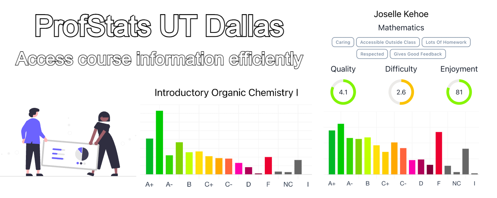

# ProfStatsUTD - Your Ultimate Course Registration Companion! 🌟

<p align="center">
  
</p>

[](https://chromewebstore.google.com/detail/profstats-ut-dallas/doilmgfedjlpepeaolcfpdmkehecdaff)

ProfStats is a handy Chrome extension that puts professor ratings and grade distributions together in one place, making it easy for students to get important info during course registration.

## Built With

[](https://gin-gonic.com/)

[](https://vitejs.dev/)

[](https://azure.microsoft.com/en-us/)

[](https://www.sqlite.org/index.html)

[](https://www.docker.com/)

## Changelog:

**Version 1.0.4:**

-   Minor bug fixes.
-   Minor UI improvements.

**Version 1.0.3:**

-   Added autocomplete for search queries.
-   Migrated the backend to Golang for improved performance.

**Version 1.0.2:**

-   Improved UI for a more user-friendly experience.
-   Fixed minor bugs.

**Version 1.0.1:**

-   Introduced dark mode and enhanced UI.
-   Added access to professors' UTDgrades and UTD employee profiles.
-   Included popular professor tags from Rate My Professor.
-   Enhanced 404 error handling for smoother navigation.
-   Added Info icon for feature requests, bug reports, and toggling dark/light mode.

**Version 1.0.0:**

-   🚀 Launched ProfStats: Your Ultimate Course Registration Companion!

## Overview

### Frontend

The frontend is constructed using Vite + React, incorporating Chakra UI for a sleek interface.

Incorporates debouncing to optimize backend requests and client-side validation for data accuracy.

Publishing new versions requires a manual build and upload to the Chrome Web Store.

### Backend

Developed in Golang with the Gin framework, dockerized, and deployed on Azure Web App through GitHub Actions.

Utilizes a SQLite database, created from CSV files in the `/raw_data` directory through the Python scripts in `/db_setup`.

Functionality involves retrieving professor ratings, grade distributions, and searching for professors and their courses.

## Local Development

> [!NOTE]  
> This project uses concurrently to run the server and extension concurrently. Check out the `package.json` file for more details.

Make sure you have the following software installed on your machine:

-   Docker
-   Node.js
-   Golang
-   Python

### Steps:

1. **Clone the repository:**

    ```bash
    git clone https://github.com/GiridharRNair/ProfStatsUTD
    ```

2. **Navigate to the project directory:**

    ```bash
    cd ProfStatsUTD
    ```

3. **Install dependencies:**

    ```bash
    npm install-packages
    ```

4. **Start the server and extension concurrently:**

    ```bash
    npm run dev
    ```

5. **Enable Developer Mode in Chrome:**

    - Navigate to `chrome://extensions/`.
    - Enable Developer Mode.

6. **Load the extension:**

    - Unpack the `dist` folder.
    - Start using the extension for seamless testing and development.

Please feel free to open an issue or submit a pull request if you have any suggestions or feedback.
