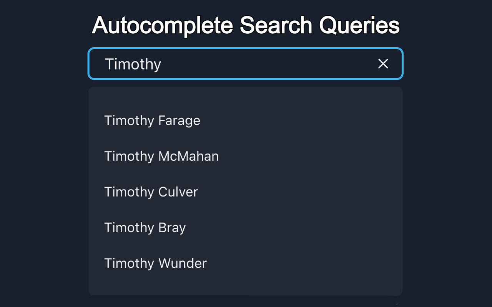

## ProfStatsUTD Frontend

This repository contains the frontend code for ProfStatsUTD, a Chrome extension designed to provide aggregated grades and professor ratings for courses at The University of Texas at Dallas (UTD). The frontend is built using Chakra UI and Vite.

<p align="center">
  
</p>

## Features

- **Interactive UI:** Utilizes Chakra UI for a responsive and user-friendly interface.
- **API Integration:** Fetches professor information from the backend API using Axios.
- **Data Visualization:** Utilizes Chakra UI to display professor ratings, department information, tags, while employing Chart.js for presenting grade distribution charts.

## Components

### 1. [App.jsx](src/App.jsx)

Main component for the extension popup. Handles data fetching and UI rendering.

### 2. [InfoIcon.jsx](src/components/InfoIcon.jsx)

Component rendering an information icon with options such as submitting feedback through GitHub and toggling between light and dark color modes.

### 3. [NotFound.jsx](src/components/NotFound.jsx)

Custom 404 error page displaying an image, error message, and GitHub issue submission button.

### 4. [ProfResults.jsx](src/components/ProfResults.jsx)

Component responsible for rendering professor results fetched from the backend API, including ratings, department information, tags, and grade distribution charts.

## Environment Configuration

To manage environment variables for different deployment scenarios, this project utilizes `.env` files. Ensure that the following configurations are set based on your development and production needs:

### Development Environment

For local development, when running the backend on port `8000`, make sure your `.env` file contains:

```env
VITE_API_URL=http://127.0.0.1:8000
```

### Production Environment

When building and deploying the backend using Docker, update your `.env.production` file to reflect the appropriate API URL, typically using `0.0.0.0`:

```env
VITE_API_URL=http://0.0.0.0
```

Please note that the `.env` files are already configured, so you may not need to modify them unless there are specific changes in your deployment setup.